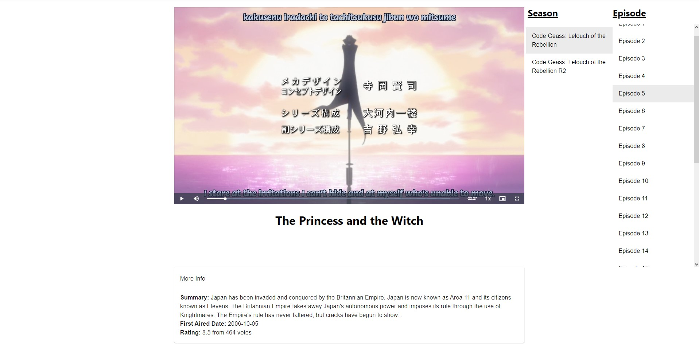

# Local Video Player Frontend
A simple react app using Material-UI and Video.js to play videos. 

Connect it to a backend that hosts .movien and/or .seriesn metadata files; video files for local videos.

#### \[Example screenshots\]




## .movien format
This is a JSON file format with specific structure:

```
{
  title: string,
  genre: list of strings,
  path: string,
  type: string
}
```
## .seriesn format
This is a JSON file format with specific structure:

```
{
  title: string,
  genre: list of strings,
  type: string,
  seasons: [
    {
      title: string,
      episodes: [
        {
          path: string,
          title: string,
          episode: number
        }
      ]
    }
  ]
}
```
